# Heart Failure Prediction Using Azure ML - Capstone Project

It is the Capstone Project of Machine Learning Engineer with Microsoft Azure Nanodegree Program. In this project, a dataset external to MS Azure Ecosystem is to be imported in Azure ML Studio and then an AutoML model, and a customized model whose hyperparameters will be tuned using HyperDrive is to be trained on this dataset. The best performing model will then deployed as a webservice and consumed via HTTP post requests. The dataset used for the implementation of this project is the Heart Failure Prediction dataset from Kaggle. And the custom model used for the hyperdrive run is Logistic regression.

## Dataset

### Overview

The dataset used in this project is the "Heart Failure Prediction" dataset, and it is obtained from [Kaggle](https://www.kaggle.com/andrewmvd/heart-failure-clinical-data). This dataset contains the medical records of 299 patients who had heart failure, collected during their follow-up period.
It has 13 features which includes age, anaemia, high_blood_pressure, diabetes, sex, smoking, etc.

### Task

Cardiovascular diseases (CVDs) are the number 1 cause of death globally, taking an estimated 17.9 million lives each year, which accounts for 31% of all deaths worldwide.  In this project, we will be predicting the mortality caused by Heart Failure using Azure ML SDK. The best-performing Machine Learning model will be deployed as a web service. All features present in the dataset are used for training purposes.

### Access

The *Heart Failure dataset* is first downloaded from this [url](https://www.kaggle.com/andrewmvd/heart-failure-clinical-data). And, then registered in the dataset section of the Azure ML Studio using *'create dataset from local file'* option.

The registered dataset can be seen in the following screenshot:

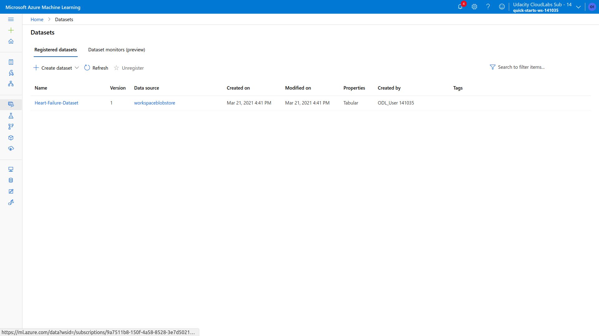

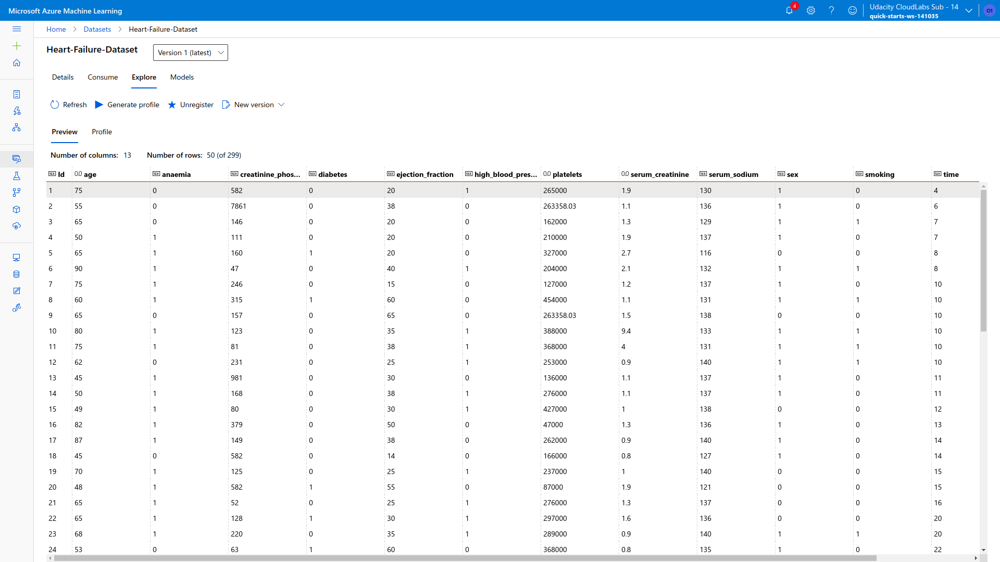

After registering the dataset in Azure ML Studio, it can be accessed in the code as follows: 
```python
key = "Heart-Failure-Dataset"
description_text = "Dataset for heart failure prediction."

if key in ws.datasets.keys(): 
        found = True
        dataset = ws.datasets[key] 
```
## Automated ML

The settings and configuration for AutoML run are as follows:
- **compute_target** : a compute cluster named *capstone-cluster* with minimum 1, and maximum 6 nodes is configured to run the AutoML experiment
- **task** : set to "classification", as we have to predict heart failure (binary value) 
- **training_data** : Heart Failure prediction dataset from Kaggle
- **label_column_name** : set to "DEATH_EVENT", and it can either have a value of 0 or 1 
- **enable_early_stopping** : set to True, to save computational resources if accuracy is not improving
- **featurization** : set to "auto", so that featurization step is done automatically
- **n_cross_validations** : set to 5
- **experiment_timeout_hours** :  set to 1 so that there is sufficient time for training the best model
- **max_concurrent_iterations** : set to 5, as it should be less than the maximum number of nodes in the cluster, which is 6 in this case
- **primary_metric** : set to 'accuracy'

### Results

The best model obtained from the AutoML run is voting ensemble which gave an overall accuracy of 87.1 %. 
The screenshots of the best AutoML model are :

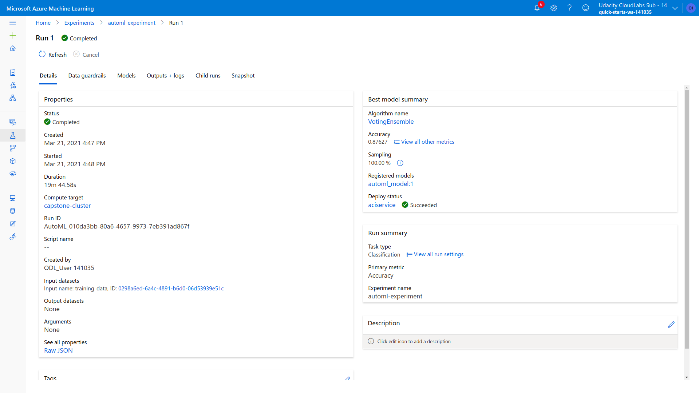


The various models generated during AutoML run are:

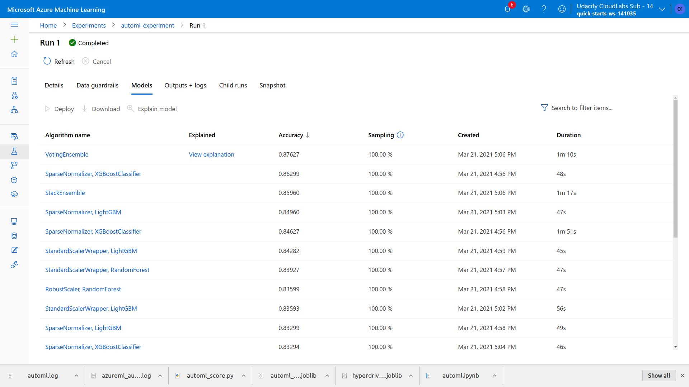

The run details widget for AutoML run is attached below:

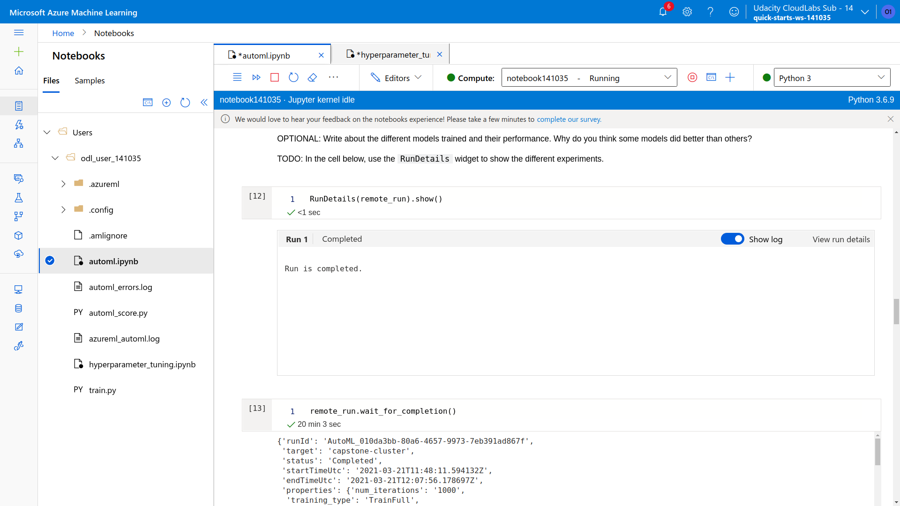

The properties of the best automl model are:
```
Best AutoML Run Model : Pipeline(memory=None,
         steps=[('datatransformer',
                 DataTransformer(enable_dnn=None, enable_feature_sweeping=None,
                                 feature_sweeping_config=None,
                                 feature_sweeping_timeout=None,
                                 featurization_config=None, force_text_dnn=None,
                                 is_cross_validation=None,
                                 is_onnx_compatible=None, logger=None,
                                 observer=None, task=None, working_dir=None)),
                                 ('prefittedsoftvotingclassifier',
                                 coef0=0.0,
                                 decision_function_shape='ovr',
                                 degree=3,
                                 gamma='scale',
                                 kernel='rbf',
                                 max_iter=-1,
                                 probability=True,
                                 random_state=None,
                                 shrinking=True,
                                 tol=0.001,
                                 verbose=False))],
                       verbose=False))],
                                 flatten_transform=None,
                                 weights=[0.16666666666666666,
                                          0.16666666666666666,
                                          0.16666666666666666,
                                          0.16666666666666666,
                                          0.16666666666666666,
                                          0.16666666666666666]))],
                                 verbose=False)
```

###Future Improvements

- Deep learning models can be used to improve performance

## Hyperparameter Tuning

The problem at hand is a binary classification problem, therefore, Logistic regression is used for Hyperdrive run. The hyper-parameters of the model that are tuned using Hyperdrive are:
- **--C** : It is Inverse of the regularization strength. This hyper-parameter helps prevent the over-fitting of model. The value for this hyperparameter is chosen by random search from this search space: 
    - \[ 0.001, 0.01, 0.1, 1, 10, 100\]
    
- **max_iter** : It is the maximum number of iterations taken to converge. The value of this hyperparameters is chosen by random sampling from the following search space:
  - \[ 25, 50, 75, 100, 125, 150, 175, 200, 225, 250, 275, 300, 325, 350, 375, 400, 425, 450, 475, 500\]

An early termination policy (Bandit Policy), is also specified to efficiently utilize the computing resources by terminating the poor performing runs. Furthermore, the maximum number of runs for this experiment is 25, and Accuracy is used as the primary metric here. 

### Results
The best hyperdrive run gave an overall accuracy of 81.7 % .The value of *'C'* is 0.001, and *max_iter* is 225 for this run.

The screenshot of the run details widget is as follows:

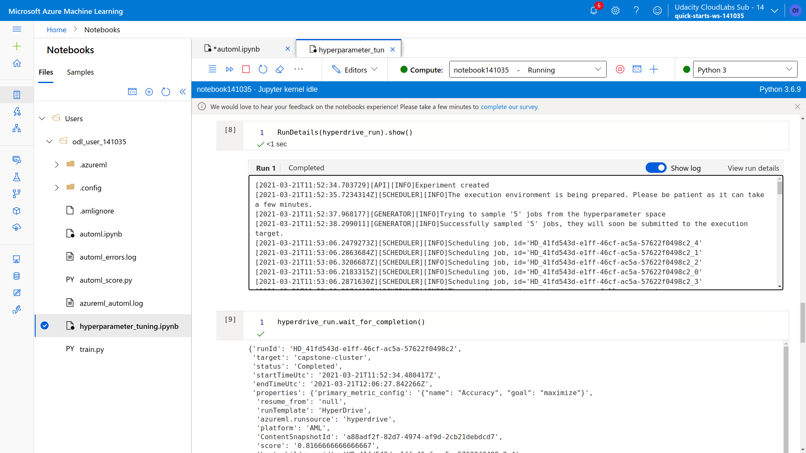

The visual representation of accuracy among various runs:

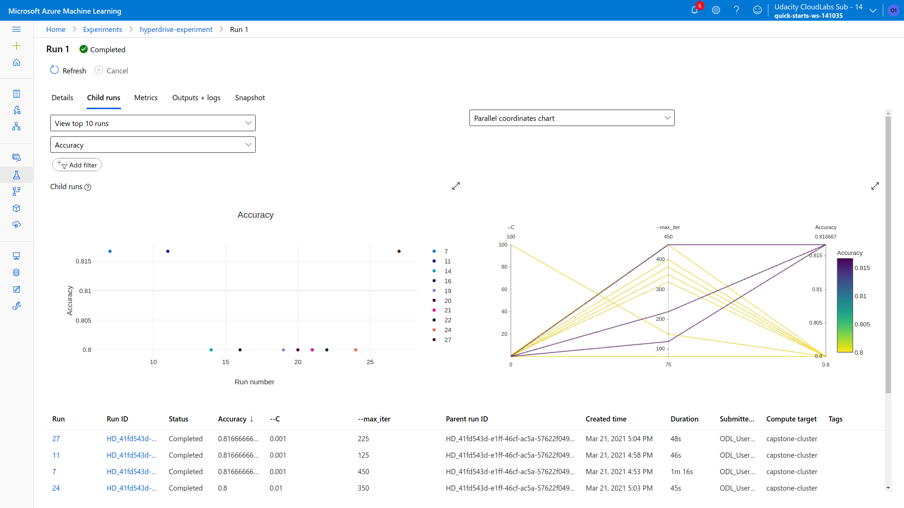

Below is the screenshot for best hyperdrive run:

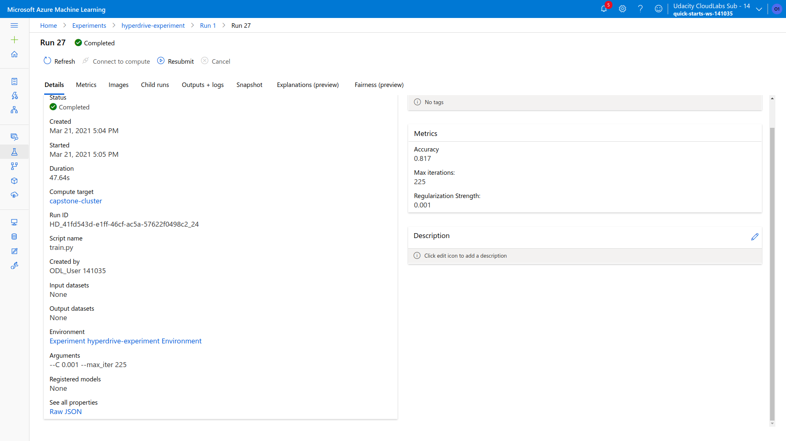

###Future Improvements:
- Feature engineering can be applied before training to keep only the useful features
- Other classification algorithms such as Random Forest, SVM , KNN can be used

## Model Deployment

The best model obtained from the AutoML run, i.e., VotingEnsemble model gave an overall accuracy of 87.1 %, which is better than the accuracy of the best hyperdrive run model accuracy, i.e., 81.7%. So, VotingEnsemble is registered as *automl_model* and deployed as a webservice on Azure Container Instance. The screenshots for the registered and deployed models are attached below:

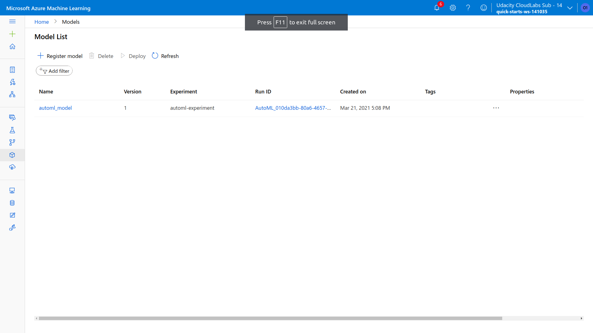

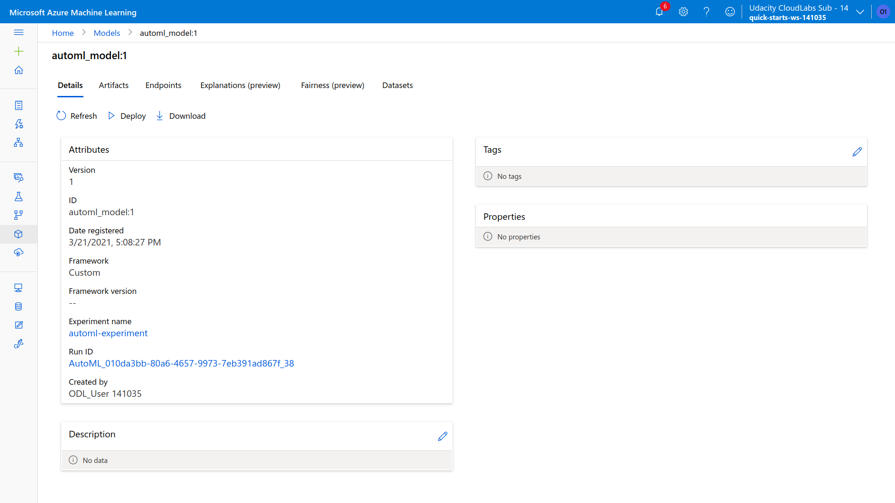

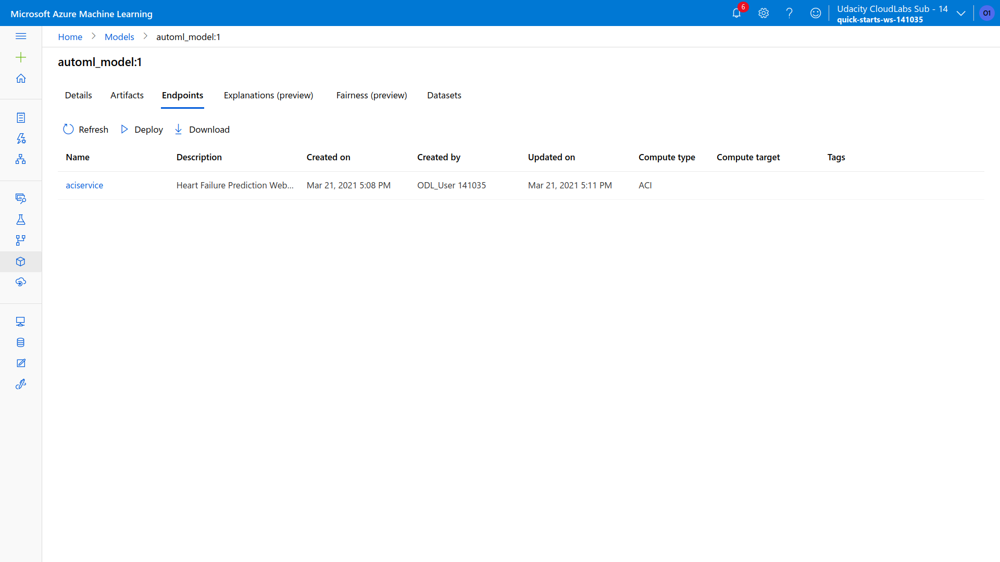

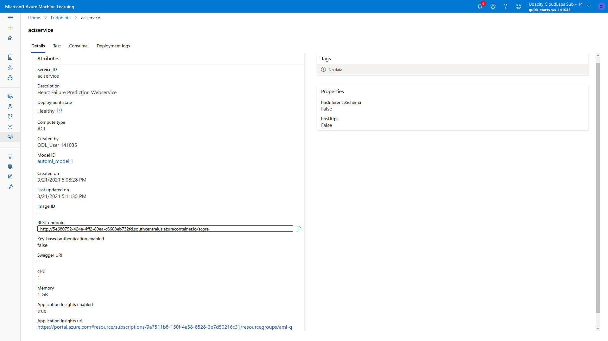

The following is the sample data for request:
```python
data = {
    "data": [
        {
            'age': 50,
            'anaemia': 0,
            'creatinine_phosphokinase': 90 ,
            'diabetes': 1,
            'ejection_fraction': 20,
            'high_blood_pressure': 1,
            'platelets': 230000,
            'serum_creatinine': 1.6,
            'serum_sodium': 120,
            'sex': 0,
            'smoking': 1,
            'time': 7
        },
        {
            'age': 70,
            'anaemia': 1,
            'creatinine_phosphokinase': 110,
            'diabetes': 0,
            'ejection_fraction': 25,
            'high_blood_pressure': 0,
            'platelets': 210000,
            'serum_creatinine': 1.8,
            'serum_sodium': 142,
            'sex': 1,
            'smoking': 0,
            'time': 8
        }
    ]
}
```

Now, the above data can be used to query the deployed webservice as follows:
```python
request_data = json.dumps(data)

# Set the content type
headers = {'Content-Type': 'application/json'}

# Make the request and display the response
response = requests.post(scoring_uri, request_data, headers=headers)
```

The predictions in the form of list, can be obtained from the response from the response object as follows:
```python
response.json()
```

## Screen Recording

The screencast of the project can be accessed [here](https://youtu.be/6HT-LYBnSnk).

## Standout Suggestions
I have attempted the standout suggestion of enabling application insights for the deployed webservice. The screenshots of logs obtained through code are attached below: 

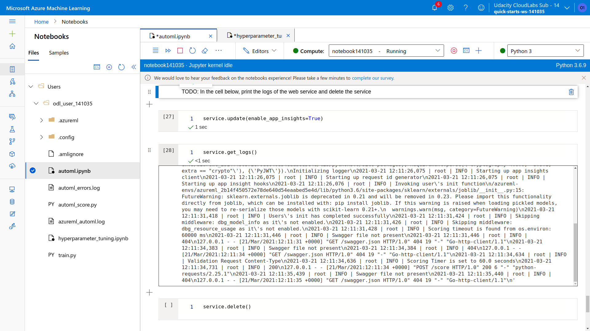

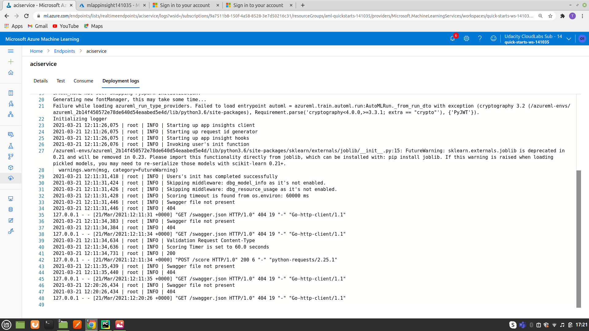